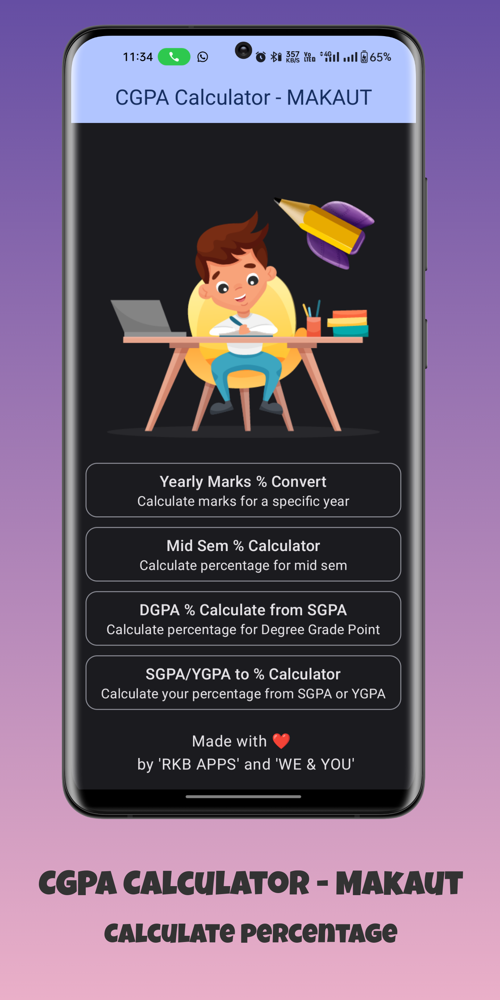
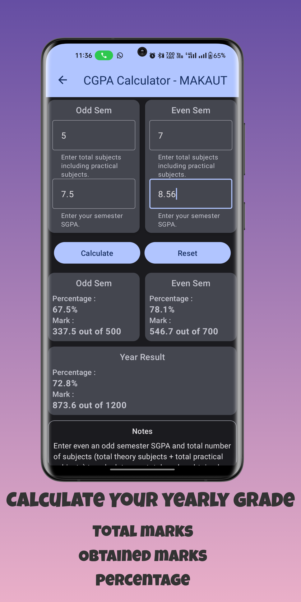
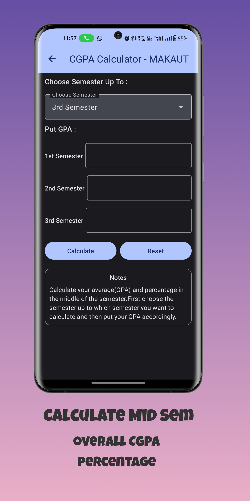
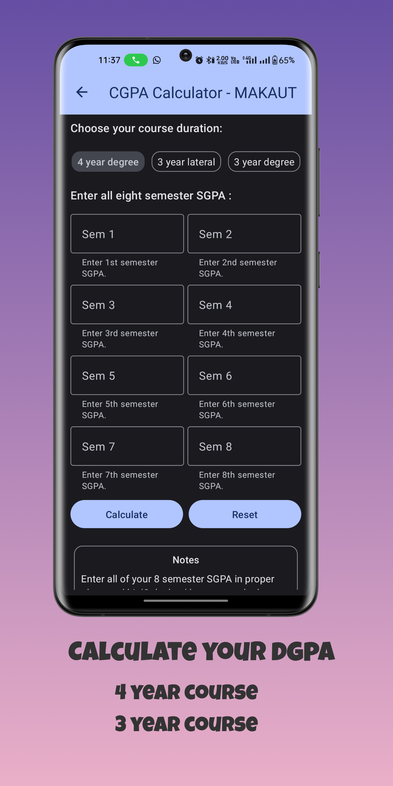

# CGPA Calculator - MAKAUT

"CGPA Calculator - MAKAUT" is a Simple App for College students Under Makaut for :

1. Convert their SGPA to Percentage and also Total Marks, Obtained Marks and Overall Percentage .
2. Calculate DGPA from all Semester Marks
3. SGPA to Marks Percentage, SGPA to Total Marks, Obtained Marks and Overall Percentage.
4. Calculate SGPA from all Semester Marks

# Screenshots

|  |  |  |
|----------------------------------------------------------|---------------------------------------------------------|---------------------------------------------------------|
|   |  |                                                         |

# Tech Stack and Libraries

- Jetpack
    - [Compose](https://developer.android.com/jetpack/compose) : A modern toolkit for building native Android UI.
    - [Navigation](https://developer.android.com/jetpack/compose/navigation) : Navigation refers to the interactions that allow users to navigate across, into, and back out from the different pieces of content within your app.
    - [Room](https://developer.android.com/jetpack/androidx/releases/room) : The Room persistence library provides an abstraction layer over SQLite to allow for more robust database access while harnessing the full power of SQLite.


# License
MIT License

```